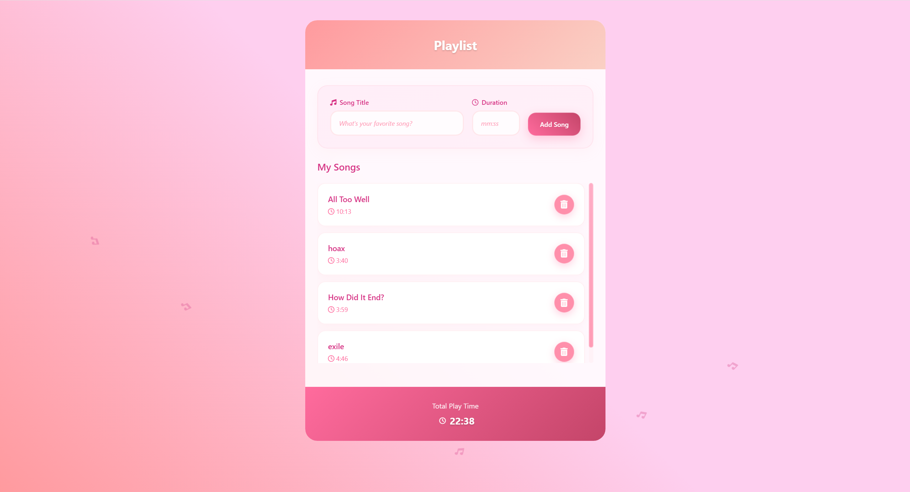

# TypeScript Assignment – Playlist Builder

A simple **Playlist Builder** built with **Vanilla TypeScript + HTML/CSS**.  
The app lets the user add songs with a title and duration. The playlist updates dynamically in the browser and shows the total play time.

## Features

- Add tracks with:
  - Title
  - Duration (`mm:ss` format)
- Display playlist with each track’s title and duration
- Remove tracks with a 🗑️ button
- Display total playlist duration in `mm:ss`

## Tech

- **TypeScript**
- **HTML / CSS**
- **DOM manipulation & event handling**

## Screenshot

